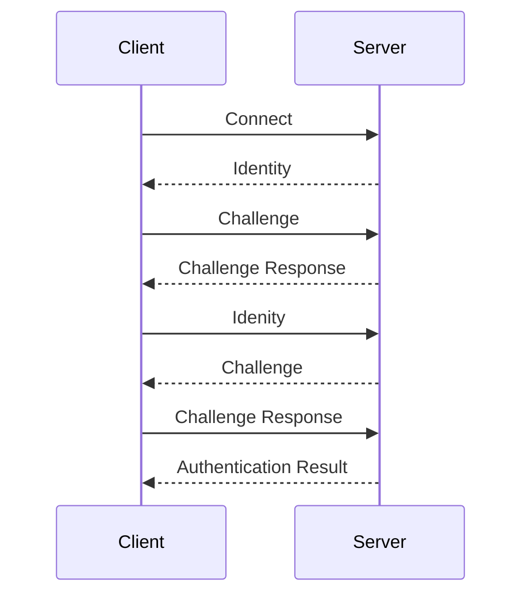
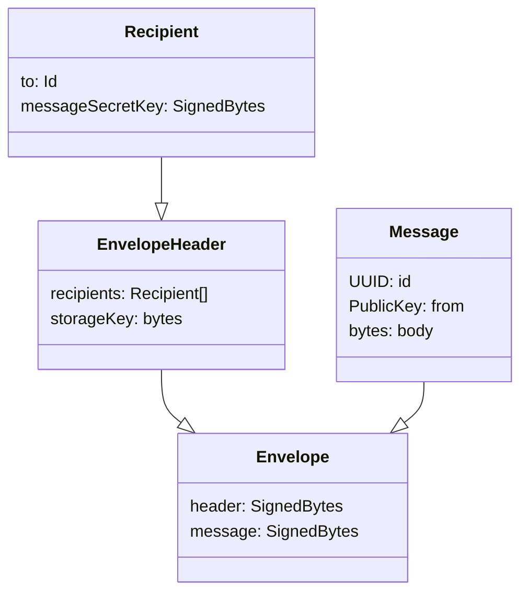

# Relay

Devices on the Internet often cannot communicate with each other directly, as they are on different networks protected by firewalls. The Relay is a key piece of the OpenCola toolkit that allows peers to communicate through a known server. In addition to providing a communication path between devices, it also supports storing messages for offline recipients that can be retrieved later, so that devices don't need to be online at the same time to exchange messages.

You can run the OpenCola application without a relay server, but this requires that your peers be on the same network or VPN, in which case peers can communicate directly of ```http```. Even in such siutations, though, it's best to use a 'local' relay server, since it can store and forward messages. 

Messages handled by the relay server are fully encrypted. Only the public key of the sender and the public keys of the reciepients are visible to the relay server and the relay server does not log any IP addresses. The relay server **does** log message delivery of messages (including sender and recipient Ids) for diagnostic purposes, which can be turned off.


## Authentication Handshake


When a client connects to the server, a handshake is performed to authenticate both the server and the client. The relay server uses protobuf messages to perform this handshake (which have corresponding Kotlin versions, as do all protobuf messages for the relay server). The messages
are:

```protobuf
message Identity {
  io.opencola.security.protobuf.PublicKey publicKey = 1;
}

message Challenge {
  io.opencola.security.protobuf.Signature.Algorithm algorithm = 1;
  bytes challenge = 2;
}

message ChallengeResponse {
  io.opencola.security.protobuf.Signature signature = 1;
}

enum AuthenticationStatus {
  NONE = 0;
  AUTHENTICATED = 1;
  FAILED_CHALLENGE = 2;
  NOT_AUTHORIZED = 3;
}

message AuthenticationResult {
  AuthenticationStatus status = 1;
} 

```


The steps in the handshake are:


| Message Source | Message                | Description                                                                                                                                                                            |
|----------------|-----------------------|----------------------------------------------------------------------------------------------------------------------------------------------------------------------------------------|
| Server         | Identity              | The server sends its public key to client                                                                                                                                              |
| Client         | Challenge             | If the server identity is trusted, the client sends a challenge (a set of random bytes) to server                                                                                      |
| Server         | ChallengeResponse    | The server signs the challenge and sends the signature to the client. There's no need to encrypt the signature, because the server publicly identifies itself.                         |
| Client         | Identity              | The client verifies the challenge, and if valid, sends its public key to the server, encrypted with the server public key.                                                             |
| Server         | Challenge             | The server decrypts the client's public key and if the client is authorized, generates a challenge and sends it to the client.                                                         | 
| Client         | ChallengeResponse    | The client signs the challenge and sends the encrypted signature to server - encrypting protects against MITM scanning client public keys for signature matches.                       |
| Server         | AuthenticationResult | The server decrypts and verifies the signature. If the signature is valid, authentication is successful and the server generates a session key to include in an authentication result. |

For clarity, the below sequence diagram shows the high level exchange:



> NOTE: Using certificates and https is another option that was considered to secure communication with the relay, but we wanted a solution that didn't rely on any 3rd party (i.e certficate authorities) and was out of the box easy to use, so went with the above approach. If there is demand, we could support https too. 
## Model
### State

Both the client and the server can be in various states during their lifetimes:

| State       | Description                                                                   |
|-------------|-------------------------------------------------------------------------------|
| Initialized | The client / server has been created, but is not ready to handle connections. |
| Opening     | The client / server is in the process of getting ready to handle connections. |
| Open        | The client / server is open connection and ready to handle connections.       |
| Closed      | The client / server has been closed connection.                               |

### Connection

A ```Connection``` is a thin wrapper around socket that allows messages to be 
passed between the ```Server``` and ```Client```s. ```Connection```s only 
know how to pass byte arrays around. A ```MessageHandler``` 
(of type ```suspend (ByteArray) -> Unit``` ) is registered, via the 
```listen``` method, that handles incoming messages. 

### Message

The relay client and server use ```Conntection```s to pass ```Message```s which have the following protobuf definition (which has a corresponding Kotlin version, as do all ):

```protobuf
message Message {
  // Unique ID of the message
  io.opencola.util.protobuf.UUID id = 1;

  // Public key of sender
  io.opencola.security.protobuf.PublicKey from = 2;

  // Body of message, in binary form, the contents of which is only understood by the application
  bytes body = 3;
}
```

Thesse ```Message```s are signed and encrypted before sending.

### Recipient

In order to send a ```Message```, one or more ```Recipient```s need to be specified:

```protobuf
message Recipient {
  // Public key of the receiver
  io.opencola.security.protobuf.PublicKey to = 1;

  // Symmetric secret key (io.opencola.security.protobuf.SecretKey) for the associated message, 
  // encrypted by the 'to' PublicKey. 
  io.opencola.security.protobuf.EncryptedBytes messageSecretKey = 2;
}
```

The same ```message``` may be sent to multiple recipients with the same secret key, but encrypted with different public keys.


### EnvelopeHeader

To deliver a ```Message```, the relay server needs to be able to know who the message is intended for. In addition, clients may send the same message multiple times (for example when requesting transactions from peers on subsequent startups), so for the sake of efficiency, the relay server needs to know if a message is a duplicate. The envelope header provides this information:

```protobuf
message EnvelopeHeader {
    // The list of recipients for a message
    repeated Recipient recipients = 1;

    // A key for the messages that allows for redundant messages to not be stored multiple times. 
    // Messages without a storage key will not be stored, even if they can't be delivered
    bytes storageKey = 2;
}
```

The ```storageKey``` is set by the application and should not contain any trackable / sensitive information. When the server receives a message that can't be delivered with a storage key that matches an already stored messsage (for the specific reipient), the relay server will *replace* the existing message. This ensures that the most up to date messages with a given ```storageKey``` get delivered. 
### Envelope

The ```EnvelopeHeader``` (encrypted and signed by the server) and the encrypted ```Message``` are sent in an ```Envelope``` payload (the actual bytes sent over a connection):

```protobuf
message Envelope {
  // Encrypted with recipients / server public key and then signed by sender (or intermediate trust node)
  io.opencola.security.protobuf.SignedBytes header = 1;

  // Encrypted with per message AES key. Contains SignedBytes that proto decodes to Message and then signed by sender
  io.opencola.security.protobuf.SignedBytes message = 2;
}
```

### Message Diagram                                                                     

For clarity, the above protobuf messages used for sending ```Messages``` is shown in the following diagram:


>
Keep in mind that ```header``` and ```message``` in ```Envelope``` are encrypted and signed versions of ```EnvelopeHeader``` and ```Message```, not the direct objects.

## Storage 

(message table and store)

## Deployment

* RootId
* Scaling

## Administration

Administration of the relay is done via the [ocr cli](./cli/README.md).