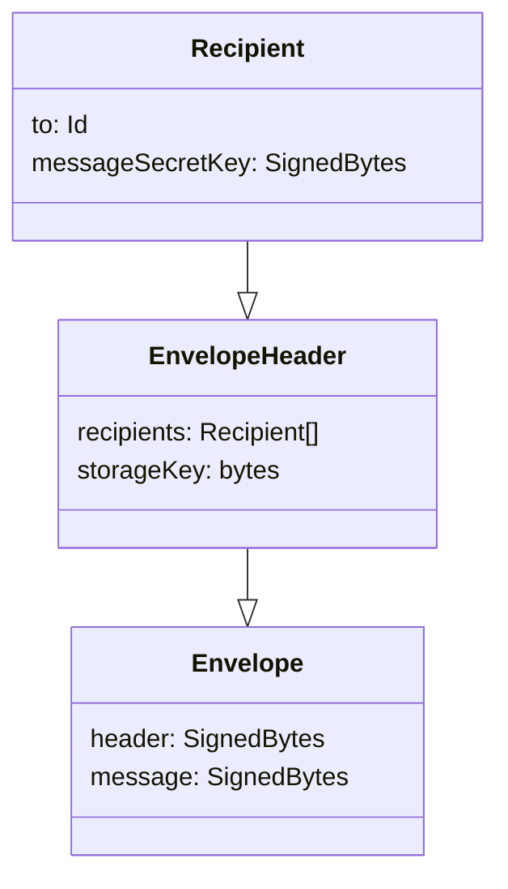

# Relay

```mermaid
classDiagram 

  class Recipient {
    to: Id
    messageSecretKey: SignedBytes
  }

  class EnvelopeHeader {
    recipients: Recipient[]
    storageKey: bytes
  }

  class Envelope {
    header: SignedBytes
    message: SignedBytes
  }


  Recipient --|> EnvelopeHeader
  EnvelopeHeader --|> Envelope
```
