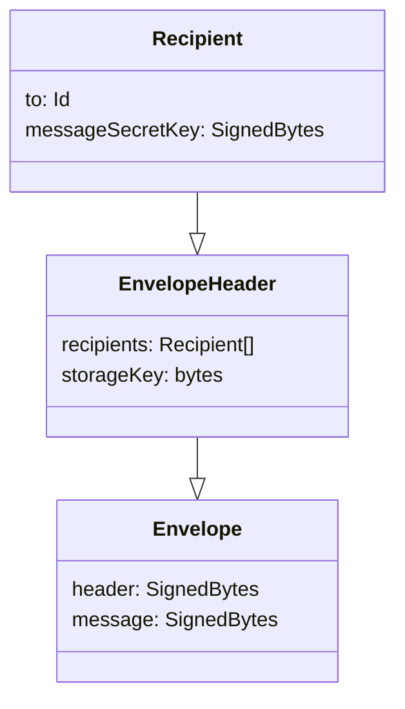

# Relay

Devices on the Internet often cannot communicate with each other directly, as they are on different networks protected by firewalls. The Relay is a key piece of the OpenCola toolkit that allows peers to communicate through a known server. Not only does it provide a communication path between devices, it also supports storing messages for offline recipients that can be retrieved later, so that devices don't need to be online at the same time to exchange messages.

You can run the OpenCola application without a relay server, but this requires that your peers be on the same network or VPN, in which case peers can communicate directly of ```http```. Even in such siutations, though, it's best to use a 'local' relay server, since it can store and forward messages. 

Messages handled by the relay server are fully encrypted. Only the public key of the sender and the public keys of the reciepients are visible to the relay server. 

To cover:

* Handshake timing
* RootId
* Policies
* [proto](./common/src/main/proto/relay.proto)



